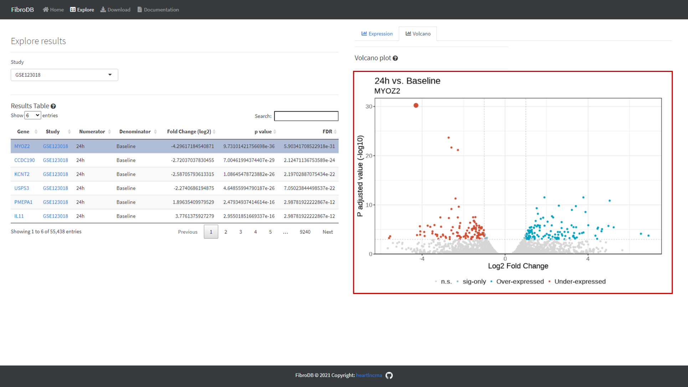

```{r setup, echo=FALSE, include=FALSE}
library(tidyverse)
library(shiny)
source("../utils.R")
```

{align="right" style="border: none; float: right;" width="360"}

**FibroDB** is a web database for **accessing and exploring fibroblast expression data.**. The data for this database was derived from four studies profiled by *Ilieva et al., 2021*. **FibroDB** is the work of the [Uchida laboratory](https://heartlncrna.github.io/){target="_blank"}, Center for RNA Medicine, Aalborg University, and the [Bioinformatics Research Network](http://bio-net.dev/){target="_blank"}.

Key features:

1. View transcriptomics data across four fibroblast studies

2. Explore differential gene expression results

3. Download standardized and reprocessed datasets

## FibroDB Interfaces and descriptions

{align="right" style="border: none; float: none;" width="1000"}

{align="right" style="border: none; float: none;" width="1000"}

## Terminology

- *DGE*: Differential Gene Expression
  - Differential Gene Expression refers to a significant difference in the expression of a gene between two conditions of interest. In this study, we calculated DGE using the [egdeR](https://bioconductor.org/packages/release/bioc/html/edgeR.html){target="_blank"} R/Bioconductor package.
- *RPKM*: Reads Per Kilobase of transcript, per Million mapped reads
  - Read counts normalized based on transcript length and read depth. [More info](https://www.rna-seqblog.com/rpkm-fpkm-and-tpm-clearly-explained/){target="_blank"}.
- *CPM*: Counts per Million
  - Read counts normalized by library size. In this case, they were normalized using the moderated counts-per-million method in [egdeR](https://bioconductor.org/packages/release/bioc/html/edgeR.html){target="_blank"}.
- *TPM*: Transcripts per Million
  - Read counts normalized based on transcript length and read depth (different from RPKM). [More info](https://www.rna-seqblog.com/rpkm-fpkm-and-tpm-clearly-explained/){target="_blank"}.


## Bugs

FibroDB is a new database, which means bugs may occasionally occur. If you encounter any bugs or unexpected behavior, please [open an issue](https://github.com/Bishop-Laboratory/FibroDB/issues/) on the RLBase GitHub repo and describe, in as much detail as possible, the following:

1.  What you expected FibroDB to do.
2.  What FibroDB did and why it was unexpected.
3.  Any error messages you received (along with screenshots).

## License and attribution

FibroDB is licensed under an MIT license and we ask that you please cite FibroDB in any published work like so:

> Ilieva et al., Systematic Analysis of Protein-Coding and Long Non-Coding RNA Genes in Fibroblasts and During Fibrosis, 2021
